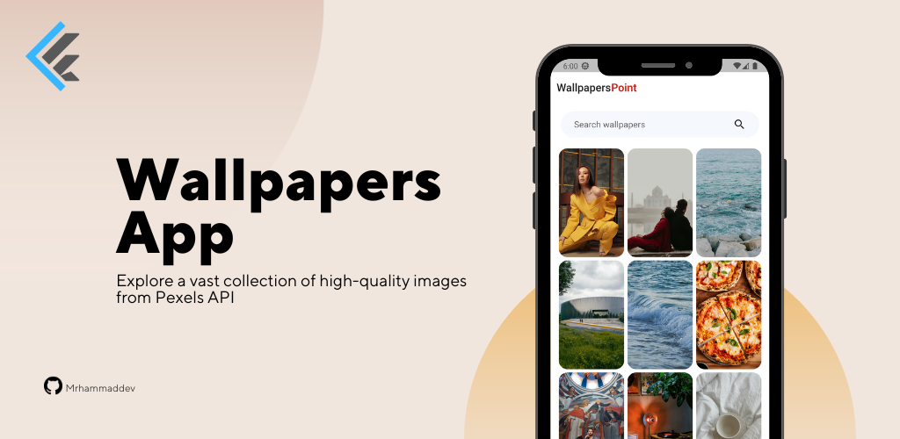
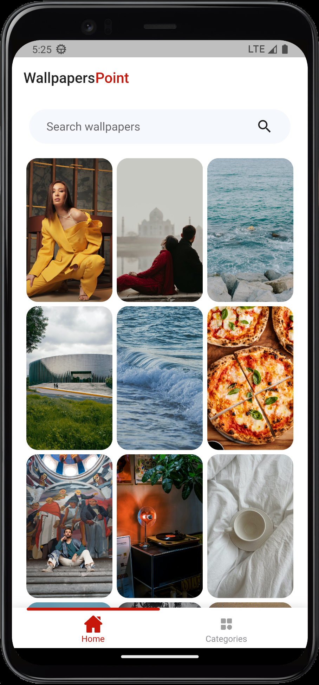
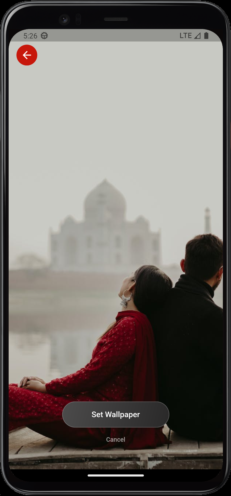
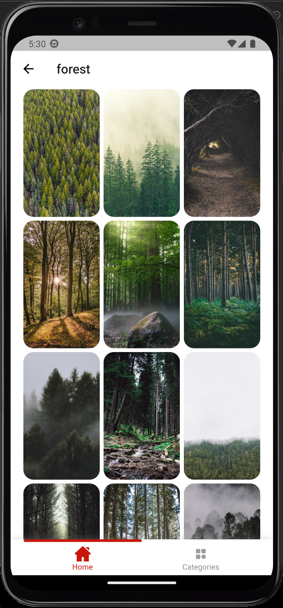
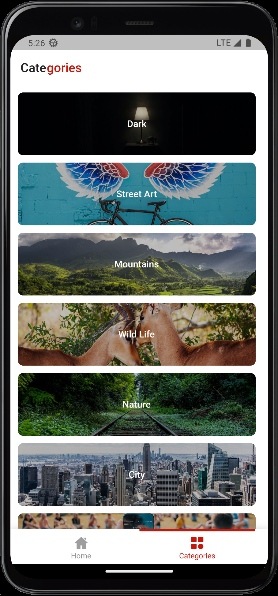
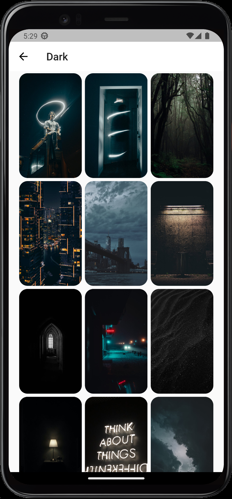

# Wallpapers App - Flutter App

## Overview

👋 Welcome to Wallpapers App, a powerful app built in Flutter that allows you to explore and download high-quality images from Pexels API.

## Features

- 🌈 Explore a vast collection of high-quality images from Pexels API
- 🖼️ Set wallpaper of your mobile device
- 🔍 Search for specific images or categories

Copywrites: - [Malik Hammad](https://github.com/mrhammaddev)

## Screenshots
<!-- Add some beautiful app screenshots here to showcase the app's functionality -->

  
  

  
  

## Known Issues
List any known issues or limitations of the app, if any.

  